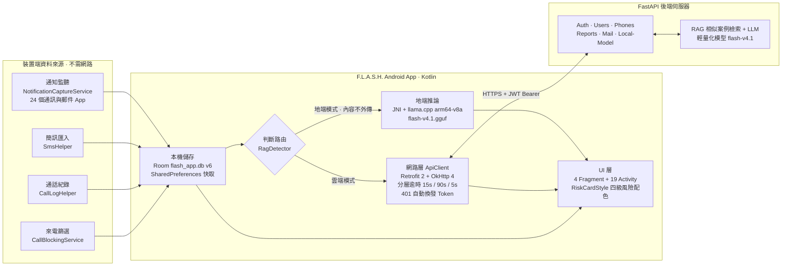

# F.L.A.S.H. — 詐騙感知防護系統


**Fraud Locator And Scam Hunter** — 一款 AI 驅動的 Android 詐騙防護 App。透過通知監聽即時擷取 LINE、簡訊、WhatsApp 等通訊軟體的來訊，結合 Gmail 信箱同步與通話紀錄，交由後端 AI 引擎分析詐騙風險；並提供「地端模式」讓訊息內容完全不離開手機。

## 目錄

- [系統概述](#系統概述)
- [核心功能](#核心功能)
- [系統架構](#系統架構)
- [技術棧](#技術棧)
- [畫面總覽](#畫面總覽)
- [後端 API](#後端-api)
- [資料儲存設計](#資料儲存設計)
- [專案結構](#專案結構)
- [安裝與執行](#安裝與執行)
- [實作進度](#實作進度)
- [UML 分析文件](#uml-分析文件)
- [繳交文件清單](#繳交文件清單)
- [作者](#作者)

---

## 系統概述

近年來詐騙手法日益多元，從假冒政府機關、投資詐騙到交友詐騙（殺豬盤），受害者遍及各年齡層。現有防詐工具大多僅提供被動式的電話號碼查詢，缺乏對**訊息內容**的即時分析。

**F.L.A.S.H.** 針對此問題提出整合式解決方案：

- **即時擷取** — 以 `NotificationListenerService` 監聽 24 個通訊／郵件 App 的通知，搭配簡訊收件匣匯入與通話紀錄讀取，資料落地於本機 Room 資料庫
- **對話層級判斷** — 不是逐則訊息分析取最高風險，而是把整個對話視窗串接成一段文字送去判斷。群組裡多人輪流佐證同一套話術，這種模式單看任何一句都看不出來
- **詐騙階段追蹤** — 標記對話演進到「接觸建立／培養信任／鋪陳誘餌／索取財物／收尾拖延」的哪一步
- **隱私優先地端模式** — 可將輕量化模型下載到手機，改由裝置本機推論，訊息內容完全不上傳
- **社群防護** — 回報詐騙電話與可疑帳號，共享情報資料庫；來電辨識與真實封鎖
- **離線可用** — 通話紀錄清單、已擷取訊息與電話風險快取在無網路時仍可瀏覽

### 風險四級制

| 等級 | 卡片顏色 | 說明 |
|------|---------|------|
| **高危（high）** | 深銹紅 `#A63D2F` | 明確詐騙行為（引導匯款、釣魚連結等） |
| **可疑（mid）** | 塵土赤陶 `#C46B4A` | 疑似詐騙（情感操控、可疑話術等） |
| **安全（safe）** | 柔和米白 `#FDFAF4` | 經 AI 判定為正常訊息 |
| **未分析（unanalyzed）** | 暖羊皮紙 `#F4F0E8` | **尚未取得判斷結果**（分析中、後端無法連線或未登入） |

> **為什麼要有第四級？** 早期版本在拿不到判斷時直接顯示為「安全」。2026-08-17 後端連線失效時，所有真實詐騙訊息都被畫成安全卡——對防詐 App 而言，這等於主動給使用者錯誤的安心感。因此改為獨立的「未分析」狀態，灰底呈現、不計入安全數量，並在列表上顯示提示條。

完整配色規範見 `res/values/colors.xml`（暖色系十色，全 App 統一）。

---

## 核心功能

### 訊息擷取與監控

- **通知監聽**（`NotificationCaptureService`）— 白名單涵蓋 24 個 App／28 個 package：LINE、WhatsApp、Messenger、Telegram、Signal、微信、Instagram、Discord、Viber、KakaoTalk、Teams、Slack、簡訊，以及 Outlook、Yahoo Mail 等郵件 App
- **摘要通知拆解** — 來源 App 只發彙總通知（「N 則新訊息」）時，讀取 `EXTRA_TEXT_LINES` 逐行拆開各存一筆，避免整批訊息漏抓
- **簡訊歷史匯入**（`SmsHelper`）— 首次授權後匯入最近 200 則收件匣簡訊
- **去重機制** — 以通知的 `notificationKey` 建立唯一索引，來源 App 重貼同一則通知不會產生重複資料

### AI 風險判斷

- **對話整體判斷** — 將對話視窗內訊息串接為「發送者: 內容」多行文字，一次送 `/rag/detect` 取得整段對話的風險等級、詐騙類型、判定理由與防詐建議
- **詐騙階段偵測** — 呼叫 `/rag/detect-conversation` 取得階段標籤；階段的連續性由 App 保存上次結果並以 `previous_stage` 帶回。後端階段模型不可用時會回傳規則推估結果，UI 會明確標示「（推估）」
- **單則即時分析** — 點擊任一訊息重新查詢完整判定理由，不使用快取
- **風險評分（0–100）** — 優先採用後端校準過的 `risk_score`；沒有時才用 `risk_level` 決定區間、`confidence` 在區間內微調
- **兩層快取** — 記憶體 Map ＋ SharedPreferences，以「訊息數:最大 id」的視窗指紋為鍵；內容沒變就沿用、一有新訊息立即失效

### 雲端 / 地端雙模式

| 模式 | 判斷位置 | 說明 |
|------|---------|------|
| **雲端模式**（預設） | 後端 FastAPI | 完整功能，包含 RAG 相似案例檢索與詐騙階段判斷 |
| **地端模式** | 手機本機 | 以 NDK/JNI 封裝 llama.cpp（arm64-v8a）在裝置上推論，**訊息內容不上傳**；地端模式下刻意不呼叫階段判斷 API |

地端模型（GGUF，約 1.9 GB）不隨 APK 發布，改由 App 向後端取得帶簽章的短效下載網址後串流下載，支援 HTTP Range 中斷續傳、斷線自動重試與 SHA-256 全檔校驗。原生程式庫僅編譯 arm64-v8a，非 arm64 裝置不會被引導下載。

### 郵件掃描

- **Gmail 帳號連接** — 透過後端完成 OAuth 授權，以深層連結（`flashapp://mail-callback`）回跳 App
- **信件同步與判斷** — 呼叫 `/mail/sync` 由後端逐封信做 AI 判斷，App 端快取結果供離線瀏覽
- **寄件者封鎖** — 可將寄件者加入封鎖清單，並於「已封鎖信箱」頁面管理

### 電話與來電辨識

- **通話紀錄清單** — 預設清單來自手機真實通話紀錄（不需網路），每支號碼標上社群回報的風險等級與舉報次數
- **號碼查詢** — 搜尋框可查詢任意號碼；連線失敗時退回本機快取
- **離線快取** — 背景以 WorkManager 定期同步社群資料庫中有風險的號碼；無網路時顯示離線提示條，清單本身照常顯示
- **來電辨識與真實封鎖** — `CallScreeningService` 攔截來電，`CallRiskOverlay` 於響鈴時顯示風險浮層
- **台灣號碼格式檢查** — 非常規格式（如境外號碼）會額外標示警告

### 詐騙回報與分享

- **電話回報** — 7 種詐騙類型選擇 ＋ 描述（至少 10 字），入口在電話清單與電話詳情頁
- **寄件者回報** — 詐騙類型 ＋ 平台 ＋ 帳號資訊，入口在郵件分頁
- **我的回報** — 查詢個人歷史回報紀錄（設定 → 我的回報紀錄）
- **警告分享** — 自動生成警告文字，一鍵分享至 LINE／WhatsApp／Messenger／SMS 或複製到剪貼簿，入口在電話詳情頁

> **目前暫時停用的入口**：對話詳情頁與帳號威脅檔案頁的「回報此帳號」與「分享警告」按鈕已隱藏。
> 原因是後端目前以（平台, 帳號顯示名稱）判斷帳號是否為同一個，實測證實同名但不相關的帳號會被
> 併為同一筆、風險分數互相污染；在後端改用可識別的帳號 ID 之前先關閉，避免顯示錯誤資訊。
> `ReportFullActivity`（完整回報表單，含 `/reports/full` 串接）已實作完成但尚未接上入口。

### 認證與設定

- **Email 登入／註冊／忘記密碼**（三步驟 OTP）、Google Credential Manager、Facebook OAuth
- **JWT 自動換發** — `TokenAuthenticator` 在任一 API 回 401 時以 `refresh_token` 換發並自動重試原請求
- **無障礙字級調整** — 小／標準／大／特大四段，全 App 生效
- **監控開關** — 訊息即時監控、郵件掃描、來電辨識、快速登入（生物辨識）等

---

## 系統架構



### 逾時策略

同一個 OkHttp base client 以 `newBuilder()` 衍生出四種變體，共用連線池：

| 用途 | connect / read / write | 理由 |
|------|------------------------|------|
| 一般端點（auth / reports / users） | 15s | 快速失敗 |
| `/rag/detect`、`/rag/detect-conversation` | 15s / **90s** | 後端需執行 LLM 推論 |
| `/mail/sync`、`/mail/messages` | 15s / **90s** | 逐封信呼叫 LLM，並即時向 Gmail API 取回欄位 |
| `/phones` 清單 | **5s** | 失敗即退回本機快取，等待無意義 |

地端模型下載使用獨立的 OkHttp 客戶端，不共用上述設定（避免 1.9 GB 回應被日誌攔截器讀進記憶體）。

---

## 技術棧

### 前端（Android App）

| 分類 | 技術 | 版本 |
|------|------|------|
| 語言 | Kotlin | 1.9.24 |
| 建置工具 | Android Gradle Plugin / Gradle | 8.5.0 / 8.7 |
| 最低 SDK | Android 8.0 (API 26) | — |
| 目標 SDK | Android 14 (API 34) | — |
| JVM | Java 17 | — |
| UI 框架 | Material Design 3 | 1.11.0 |
| 佈局綁定 | View Binding | — |
| 導航 | AndroidX Navigation | 2.7.6 |
| 列表元件 | RecyclerView | 1.3.2 |
| **本機資料庫** | **Room（含 kapt 編譯器）** | **2.6.1** |
| **背景排程** | **WorkManager** | **2.9.0** |
| 網路層 | Retrofit 2 + OkHttp 4 | 2.9.0 / 4.12.0 |
| JSON 序列化 | Gson | 2.9.0 |
| 生物辨識 | AndroidX Biometric | 1.1.0 |
| Google 登入 | Credential Manager + Google ID | 1.3.0 / 1.1.1 |
| Facebook 登入 | Facebook Login SDK | 17.0.2 |
| **地端推論** | **llama.cpp（NDK / JNI，arm64-v8a）** | — |

### 後端

| 分類 | 技術 |
|------|------|
| 框架 | FastAPI (Python) |
| 認證 | JWT（access_token + refresh_token） |
| AI | RAG 相似案例檢索 ＋ LLM（Ollama） |
| 模型 | flash-v4.1（GGUF，Q4_K_M 量化） |
| 部署 | Cloudflare Tunnel |

---

## 畫面總覽

本 App 包含 **19 個 Activity**、**4 個 Fragment**、**6 個 Dialog/BottomSheet**，共 **41 個 XML 佈局檔**、**84 個 Kotlin 原始碼檔**（約 10,700 行）。

### 認證流程

| 畫面 | 說明 |
|------|------|
| SplashActivity | 啟動畫面，動畫進度條後依登入狀態導向 |
| LoginActivity | Email/密碼登入 ＋ 保持登入 ＋ Google/Facebook 入口 |
| RegisterActivity | 註冊表單，含密碼強度即時指示器 |
| ForgotPasswordActivity | 三步驟忘記密碼（ViewFlipper）：Email → OTP → 新密碼 |
| GooglePickerActivity | Google Credential Manager 整合 |
| FacebookPickerActivity | Facebook 帳號選擇頁 |
| MailOAuthCallbackActivity | Gmail 授權完成後的深層連結回跳 |

### 主要頁面（底部導航四頁籤）

| 頁籤 | Fragment | 功能 |
|------|----------|------|
| 訊息 | MessagesFragment | 風險警報列表 ＋ 統計摘要 ＋ 風險/平台雙重篩選 ＋ 左滑刪除 |
| 郵件 | EmailFragment | 已同步信件的風險列表 ＋ 篩選 ＋ 寄件者封鎖 |
| 電話 | PhoneFragment | 通話紀錄風險清單 ＋ 號碼查詢 ＋ 離線快取提示 |
| 設定 | SettingsFragment | 個人資料、文字大小、AI 判斷模式、監控開關；並作為我的回報紀錄／可疑帳號列表／封鎖名單／封鎖信箱／已連接信箱的入口 |

### 詳情與管理頁面

| 畫面 | 說明 |
|------|------|
| ThreadDetailActivity | 對話詳情：風險膠囊、風險評分、詐騙階段提示條、聊天氣泡、整體對話判斷 |
| AccountDetailActivity | 帳號威脅檔案：風險環形圖 ＋ 觸發規則 ＋ 證據摘要（目前為檢視用，回報與分享入口暫時停用） |
| PhoneDetailActivity | 電話詳情：社群回報記錄（回報者身分已遮蔽）＋ 撥打/封鎖/回報/分享 |
| MailAccountsActivity | 已連接信箱管理（連接、移除、封鎖寄件者） |
| MailMessageDetailActivity | 信件詳情與 AI 判斷結果 |
| BlockedNumbersActivity | 已封鎖號碼清單 |
| BlockedEmailsActivity | 已封鎖寄件者清單 |
| SuspectAccountsActivity | 可疑帳號清單 |
| MyReportsActivity | 我的回報紀錄 |
| ReportFullActivity | 完整回報表單（已實作並串接 `/reports/full`，**尚未接上入口**） |
| ShareWarningActivity | 警告分享（多平台） |

---

## 後端 API

App 端共串接 **9 組 API 介面、33 個端點**。所有需授權的端點皆以 `Authorization: Bearer <access_token>` 呼叫。

### 認證 `AuthApi`

| 方法 | 路徑 | 說明 |
|------|------|------|
| POST | `/api/v1/auth/login` | 登入，回傳 JWT |
| POST | `/api/v1/auth/register` | 註冊，回傳 JWT |
| POST | `/api/v1/auth/refresh` | 以 refresh_token 換發新 access_token |
| POST | `/api/v1/auth/logout` | 登出 |
| POST | `/api/v1/auth/forgot-password` | 發送 OTP 到 Email |
| POST | `/api/v1/auth/verify-otp` | 驗證 6 位 OTP |
| POST | `/api/v1/auth/reset-password` | 重設密碼 |
| POST | `/api/v1/auth/change-password` | 變更密碼 |
| POST | `/api/v1/auth/oauth` | 社交登入（Google / Facebook） |

### AI 風險判斷 `RagApi`

| 方法 | 路徑 | 說明 |
|------|------|------|
| POST | `/api/v1/rag/detect` | 判斷一段文字的詐騙風險 |
| POST | `/api/v1/rag/detect-conversation` | 判斷對話演進到哪個詐騙階段 |

`/rag/detect` 主要回應欄位：`is_scam`、`risk_level`、`scam_type`、`confidence`、`risk_score`（校準值）、`reasons`、`advice`、`similar_cases`、`model`。

### 電話情報 `PhoneApi`

| 方法 | 路徑 | 說明 |
|------|------|------|
| GET | `/api/v1/phones` | 號碼清單（可依風險等級篩選、關鍵字搜尋、分頁） |
| GET | `/api/v1/phones/{phone_number}` | 單一號碼詳情與社群回報記錄 |

### 回報 `ReportApi`

| 方法 | 路徑 | 說明 |
|------|------|------|
| POST | `/api/v1/reports/phone/{phone_number}` | 回報詐騙電話號碼 |
| POST | `/api/v1/reports/account` | 回報可疑社群帳號 |
| POST | `/api/v1/reports/full` | 提交完整詐騙回報 |
| GET | `/api/v1/reports/mine` | 查詢個人回報紀錄 |

### 信箱 `MailApi`

| 方法 | 路徑 | 說明 |
|------|------|------|
| GET | `/api/v1/mail/connect/{provider}` | 取得 OAuth 授權網址 |
| GET | `/api/v1/mail/accounts` | 已連接的信箱清單 |
| DELETE | `/api/v1/mail/accounts/{account_id}` | 移除已連接信箱 |
| POST | `/api/v1/mail/sync` | 同步信件並執行 AI 判斷 |
| GET | `/api/v1/mail/messages` | 取得已分析的信件清單 |
| GET | `/api/v1/mail/messages/{analysis_id}/content` | 取得信件完整內容 |
| POST | `/api/v1/mail/accounts/{account_id}/block-sender` | 封鎖寄件者 |
| GET | `/api/v1/mail/accounts/{account_id}/blocked-senders` | 已封鎖寄件者清單 |
| DELETE | `/api/v1/mail/accounts/{account_id}/blocked-senders/{sender}` | 解除封鎖 |

### 可疑帳號 `AccountApi` / 使用者 `UserApi` / 地端模型 `LocalModelApi`

| 方法 | 路徑 | 說明 |
|------|------|------|
| GET | `/api/v1/accounts` | 可疑帳號清單 |
| GET | `/api/v1/accounts/{account_id}` | 可疑帳號詳情 |
| GET | `/api/v1/users/me` | 個人資料 |
| PATCH | `/api/v1/users/me` | 更新個人資料 |
| GET | `/api/v1/users/me/settings` | 取得設定 |
| PUT | `/api/v1/users/me/settings` | 更新設定 |
| GET | `/api/v1/local-model/manifest` | 取得模型版本、大小、SHA-256 與短效簽章下載網址 |

> **後端位址**（開發測試用）
>
> ```
> https://prep-gregory-madrid-replacing.trycloudflare.com
> ```
>
> - 互動式 API 文件：[`/docs`](https://prep-gregory-madrid-replacing.trycloudflare.com/docs)（Swagger UI）
> - OpenAPI 規格：`/openapi.json` — 後端共提供 **35 條路徑、53 個資料模型**，App 端使用其中 31 條
> - 健康檢查：`/health`
>
> ⚠️ **此為 Cloudflare Tunnel 臨時網址，會隨後端重啟而變更。** 網址設定於
> `app/src/main/java/com/frauddetector/network/ApiConfig.kt` 的 `BASE_URL`；
> 若 App 無法連線，請向後端開發者索取最新網址後重新編譯（歷史網址保留在同一個檔案的註解區塊）。

---

## 資料儲存設計

### 本機（Android 裝置）

**Room 資料庫 `flash_app.db`（schema v6，2 張表）**

| 資料表 | 用途 | 重點設計 |
|--------|------|---------|
| `captured_notifications` | 通知擷取與簡訊匯入的訊息／郵件 | `notificationKey` 唯一索引擋重複；快取 AI 判斷結果（`riskLevel` / `scamType` / `aiReason` / `confidence`） |
| `cached_phones` | 電話風險資料的離線快取 | 以 `phoneNumber` 為主鍵，整批取代避免殘留舊資料 |

主要查詢：`getLatestMessagePerConversation()` 取每個對話的最新一筆。以 `MAX(timestamp)` 而非 `MAX(id)` 判斷「最新」（簡訊匯入時較新的訊息反而拿到較小的 id），並在分組條件中區分群組與私訊，避免同名對話被合併。

**SharedPreferences**

| 命名空間 | 內容 |
|---------|------|
| `flash_auth` | JWT access/refresh token、使用者基本資料 |
| `rag_conversation_cache` | 對話風險判斷快取（含視窗指紋） |
| `rag_conversation_stage` | 詐騙階段判斷快取 |
| `detection_mode` | 雲端／地端模式、已下載模型的檔名與版本 |
| `email_fragment_cache` | 郵件列表快取 |
| `font_scale_prefs` | 字級設定 |
| `flash_blocked_emails` | 已封鎖寄件者 |

> 對話快取刻意存放於 SharedPreferences 而非 Room：資料庫目前採 `fallbackToDestructiveMigration()`，為了快取而變更 schema 會連帶清空使用者的擷取紀錄。

### 伺服器端

後端資料庫由後端組員設計與維護（MySQL）。以下依 API 回應模型（`/openapi.json` 的 53 個 schema）整理出 App 端實際會接觸到的資料實體：

| 資料實體 | 主要欄位 | 對應 API 模型 |
|---------|---------|--------------|
| 使用者 | `id`、`email`、`name`、`avatar_url`、`email_verified`、`created_at` | `UserOut` |
| 使用者設定 | `message_monitoring`、`email_scanning`、`call_detection`、`quick_login`、`high_risk_alert`、`daily_report` | `UserSettingsOut` |
| 電話號碼 | `phone_number`、`risk_level`、`fraud_type`、`report_count`、`last_reported_at` | `PhoneOut` |
| 電話社群回報 | `reporter`（已遮蔽）、`fraud_type`、`content`、`created_at` | `PhoneCommunityReportOut` |
| 可疑帳號 | `platform`、`account_name`、`external_account_id`、`risk_level`、`risk_score`、`report_count`、`ai_summary`、`triggered_rules` | `SuspectAccountOut` / `SuspectAccountDetailResponse` |
| 帳號證據項目 | `evidence_type`、`severity`、`description`、`occurred_at` | `EvidenceItemOut` |
| 已連接信箱 | `provider`、`email_address`、`is_active`、`connected_at`、`last_synced_at`、`last_sync_error` | `MailAccountOut` |
| 信件分析結果 | `message_id`、`sender`、`subject`、`received_at`、`risk_level`、`scam_type`、`confidence`、`reasons`、`advice`、`model` | `MailMessageItem` |
| 封鎖寄件人 | `sender_address`、`provider_filter_id`、`created_at` | `MailBlockedSenderOut` |
| 回報紀錄 | `kind`、`target`、`fraud_type`、`content`、`status`、`case_number` | `MyReportItem` |
| 地端模型版本 | `version`、`file_name`、`size_bytes`、`sha256`、`download_url`、`expires_at` | `LocalModelManifest` |

密碼雜湊、OAuth 憑證與 refresh token 皆由後端保管，**不落地於裝置**；App 端只儲存 JWT 與必要的顯示用欄位。

---

## 專案結構

```
B12Project/
├── README.md                    # 本文件
├── INSTALL.md                   # 安裝、執行、測試說明
├── build.gradle.kts             # 專案層級 Gradle 配置
├── settings.gradle.kts
├── gradle/                      # Gradle Wrapper
├── docs/                        # 設計文件書
├── presentations/               # 書面報告 PDF
├── uml/                         # UML 分析圖
├── 專題報告影片/                 # 簡報影片
├── release/
│   └── app-debug.apk            # 可執行檔
├── docker/
│   └── Dockerfile.android-build # 容器化建置環境
├── native/                      # 地端推論的 C++ / JNI 原始碼
│   ├── CMakeLists.txt
│   └── flash_inference.cpp
├── scripts/                     # 來電模擬測試腳本
├── tools/
│   └── local_model_smoke_test.py
└── app/
    ├── build.gradle.kts
    └── src/main/
        ├── AndroidManifest.xml
        ├── assets/
        │   └── flash-v4.1-modelfile.txt   # 地端模型的 system prompt
        ├── jniLibs/arm64-v8a/             # llama.cpp 原生程式庫
        ├── java/com/frauddetector/
        │   ├── FlashApplication.kt
        │   ├── ui/
        │   │   ├── auth/       # 認證（7 個 Activity）
        │   │   ├── main/       # 主畫面（MainActivity + 4 Fragment）
        │   │   ├── detail/     # 詳情與管理（11 個 Activity）
        │   │   ├── dialog/     # 6 個 Dialog / BottomSheet
        │   │   ├── RiskCardStyle.kt      # 四級風險配色（唯一來源）
        │   │   ├── RiskFilterChips.kt
        │   │   └── SwipeToDeleteHelper.kt
        │   ├── adapter/        # 6 個 RecyclerView 適配器
        │   ├── network/        # 9 組 API 介面 + ApiClient + Token 管理
        │   ├── service/        # 18 個服務與工具類別
        │   │   ├── NotificationCaptureService.kt   # 通知監聽
        │   │   ├── CallBlockingService.kt          # 來電篩選
        │   │   ├── RagDetector.kt                  # 判斷路由與快取
        │   │   ├── LocalModelDetector.kt           # 地端推論
        │   │   ├── LocalModelDownloader.kt         # 模型私有下載
        │   │   ├── PhoneSyncManager.kt / Worker.kt # 離線同步
        │   │   └── ...
        │   ├── db/             # Room 實體與 DAO
        │   └── data/Models.kt  # UI 資料模型
        └── res/
            ├── layout/         # 41 個 XML 佈局
            ├── drawable/       # 圖示與 Drawable
            ├── values/         # colors / strings / themes
            └── mipmap-*/       # App 圖示
```

---

## 安裝與執行

### 環境需求

- Android Studio Hedgehog (2023.1) 或以上
- JDK 17、Android SDK 34
- 實體裝置或模擬器（API 26+）

### 快速開始

```bash
git clone https://github.com/cgub12project/B12Project.git
cd B12Project
```

以 Android Studio 開啟專案，Gradle Sync 完成後選擇裝置並點擊 **Run**。

或直接安裝預先建置的 APK：[`release/app-debug.apk`](release/app-debug.apk)

### 權限

| 權限 | 用途 | 授權方式 |
|------|------|---------|
| `INTERNET` | API 通訊 | 安裝時自動 |
| `READ_SMS` | 匯入簡訊收件匣 | 執行時詢問 |
| `READ_CALL_LOG` | 讀取通話紀錄產生電話清單 | 執行時詢問 |
| `READ_PHONE_STATE` | 來電辨識 | 執行時詢問 |
| `USE_BIOMETRIC` | 生物辨識快速登入 | 安裝時自動 |
| `SYSTEM_ALERT_WINDOW` | 響鈴時顯示風險浮層 | **需至系統設定手動開啟** |
| 通知使用權 | 擷取通訊 App 的通知 | **需至系統設定手動開啟** |
| 來電篩選 App | 攔截與封鎖來電 | **需設為預設來電 App** |

> **首次使用必須手動開啟通知使用權**（設定 → 應用程式 → 特殊應用程式存取權 → 通知存取權 → 允許 F.L.A.S.H.），否則訊息分頁不會有任何資料。詳細步驟見 [INSTALL.md](INSTALL.md)。

---

## 實作進度

### 已完成並實測

| 模組 | 功能 | 狀態 |
|------|------|------|
| 認證 | 登入 / 註冊 / 忘記密碼（3 步驟）/ 變更密碼 / OAuth 入口 | ✅ 已串接 API |
| Token 管理 | JWT 儲存、401 自動換發並重試原請求 | ✅ 已串接 API |
| 訊息擷取 | 通知監聽（24 App）、摘要通知拆解、簡訊匯入、去重 | ✅ 本機實作完成 |
| 本機資料庫 | Room v6、對話分組查詢、風險結果快取 | ✅ 完成 |
| 風險判斷 | 對話整體判斷、兩層快取、四級風險呈現 | ✅ 已串接 API |
| 詐騙階段 | 階段偵測與連續性追蹤、推估結果標示 | ✅ 已串接 API |
| 訊息頁 | 統計摘要、風險/平台雙重篩選、左滑刪除、即時刷新 | ✅ 完成 |
| 郵件 | Gmail OAuth 連接、信件同步與判斷、寄件者封鎖 | ✅ 已串接 API |
| 電話 | 通話紀錄清單、號碼查詢、離線快取、背景同步 | ✅ 已串接 API |
| 來電辨識 | CallScreeningService 攔截、風險浮層、真實封鎖 | ✅ 實作完成 |
| 回報 | 電話回報 / 寄件者回報 / 我的回報紀錄 | ✅ 已串接 API |
| 分享警告 | 警告文字生成 ＋ 多平台分享 ＋ 剪貼簿 | ✅ 完成 |
| 設定 | 個人資料、字級調整、監控開關、AI 判斷模式 | ✅ 已串接 API |
| 地端模型下載 | 簽章下載、Range 續傳、斷線重試、SHA-256 校驗 | ✅ 六種情境實測通過 |
| 地端推論 | NDK/JNI 封裝 llama.cpp、ChatML prompt、輸出解析 | ✅ 實作完成 |

### 已知限制與待處理

| 項目 | 說明 |
|------|------|
| 地端推論效能 | 尚未在實體 arm64 手機上量測。模擬器為 x86 二進位翻譯執行 arm64，測得數據不具參考價值 |
| 地端模型誤判 | 已知會將合法驗證碼簡訊誤判為詐騙（測試中 5 種變體全數誤判），App 已在下載前的說明對話框主動揭露此限制 |
| 帳號比對 | 後端目前以（平台, 顯示名稱）判斷帳號是否相同，同名不同人會互相污染分數。受影響的三處已主動停用：對話詳情頁的帳號風險評分、「回報此帳號」按鈕、帳號威脅檔案頁的回報與分享按鈕 |
| 完整回報表單 | `ReportFullActivity` 已實作並串接 `/reports/full`，但尚未從任何畫面接上入口 |
| 摘要通知解析 | 拆解格式尚未以真實通知洪峰驗證 |
| 後端網址 | Cloudflare Tunnel 臨時網址會變更，尚未換為固定網域 |
| 資料庫遷移 | 目前採 `fallbackToDestructiveMigration()`，尚未撰寫 Migration |
| Token 儲存 | 使用一般 SharedPreferences，尚未改用 `EncryptedSharedPreferences` |

### 成果說明

本專題已完成 Android 端從**資料擷取 → 本機儲存 → AI 判斷 → 風險呈現**的完整實作，共 84 個 Kotlin 原始碼檔（約 10,700 行）與 41 個 XML 佈局檔。認證、風險判斷、電話情報、信箱同步、回報等模組皆已與 FastAPI 後端完成串接並實測；訊息擷取、本機資料庫、離線快取、來電辨識與地端推論則為裝置端實作。

早期版本使用 `SampleData.kt` 模擬資料呈現畫面，該檔案已移除，目前全部改為真實資料來源（通知擷取、簡訊、通話紀錄、Gmail 同步）與後端 API。

---

## UML 分析文件

本專題附有完整的 UML 軟體分析報告，涵蓋以下圖形：

| UML 圖 | 說明 |
|---------|------|
| 使用案例圖（Use Case Diagram） | 系統功能總覽，識別 Actor 與所有 Use Case |
| 使用案例描述 | 21 份逐案例的詳細描述 |
| 活動圖（Activity Diagram） | 登入、密碼重設、訊息監控與調查、電話查詢、郵件掃描等流程 |
| 類別圖（Class Diagram） | 系統領域問題類別圖（認證、訊息/郵件、電話/回報、總覽） |
| 概念模型、詞彙表 | 領域概念與名詞定義 |

---

## 繳交文件清單

| # | 項目 | 位置 | 說明 |
|---|------|------|------|
| 1 | 原始程式碼（含完整註解） | [`app/src/`](app/src/) | 84 個 Kotlin 原始碼 ＋ 41 個 XML 佈局檔，皆附中文註解 |
| 2 | 可執行檔案 + 安裝說明 | [`release/app-debug.apk`](release/app-debug.apk)、[`INSTALL.md`](INSTALL.md) | Debug APK ＋ 安裝、執行、測試說明 |
| 3 | 書面報告文件 | [`presentations/`](presentations/)、[`docs/`](docs/) | 第一次、第二次書面報告與設計文件書 |
| 4 | UML 分析文件 | [`uml/`](uml/) | 使用案例圖、活動圖、類別圖、概念模型、詞彙表 |
| 5 | 簡報影片 | [`專題報告影片/`](專題報告影片/) | 第二次報告簡報影片 |
| 6 | README.md | 本文件 | 專題完整說明文件 |

---

## 作者

- **B1229003** — UI/UX開發（Android App / UI）
- **B1229026** — 後端開發（API / Server）
- **B1229041** — AI開發（AI 模型訓練部署）
- **B1229067** — Android 端開發與整合（介面實作、API 串接、App 端功能實現）

---

## 指導教授

- **李春良 教授**
